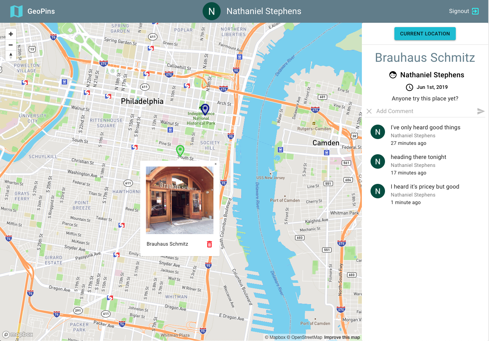

# GeoPins

Full-stack CRUD app allowing logged-in users to place pins on a map (with photo and description), view others' pins, and comment on pins...all updated in real time. All pins are saved to a database.  Local storage is used to save user's previous map location for improved UX and load times when revisiting site.

Logging in with Google OAuth is necessary to demo app. Removed image upload requirement for new pins for demoing purposes.  New pins bounce in and are green for first 30 minutes, thereafter blue-ish.  Current location pin, if activated and given permission, is pink.

### View [working demo](https://geopins-nds.herokuapp.com/)

> When viewing hosted app, initial load time might be extended due to Heroku spinning up dormant instance

---

### Libraries and services used...
- Mapbox
- React (hooks, React Router, react-map-gl)
- Material UI
- Google OAuth 2.0
- Geolocation API
- Cloudinary for image hosting
- Apollo GraphQL server and client (including subscriptions)
- Node / Express
- MongoDB Atlas / Mongoose
- etc...

